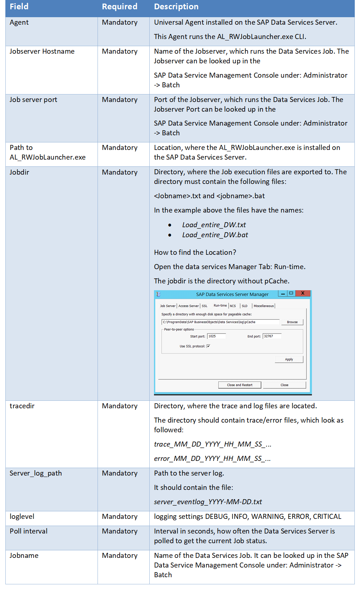

# ut-sap-bods-v4-2-etl-win
# Abstract: 

This Universal Task allows to execute an SAP Data Services “ETL” Job using the “AL_RWJobLauncher.exe” utility which comes with the SAP
Data Services installation

# 1.	Disclaimer

No support and no warranty are provided by Stonebranch GmbH for this document and the related Universal Task. The use of this document and
the related Universal Task is on your own risk.

Before using this task in a production system, please perform extensive testing.

Stonebranch GmbH assumes no liability for damage caused by the performance of the Universal Tasks

# 2.	Introduction

The here described Universal Task allows to execute an SAP Data Services “ETL” Job using the “AL_RWJobLauncher.exe” utility which comes
with the SAP Data Services installation. 

The tool is explained in the attached document [1] from page 45 onwards.

Some details about the universal task for SAP Data Services:
-	It is based on the “AL_RWJobLauncher.exe” which is part of the Data Services Install
-	The Data Services Windows Server needs to have Python 3.6.3 installed
-	The Data Service Windows Server needs to have a Universal Agent installed
- For Data Services on Linux Server a separate Universal Task can be provided. 
- The Universal Task will provide the same error and trace information as the SAP Data Services Management Console.
- You can select different log-levels e.g. Info and debug
- You can configure all connection Parameters via the Universal Task
- For all Parameters an exception handling has been implemented
- Restriction: Currently only “Enterprise Security” is supported

# 2.1	Software Requirements

**Universal Task name:** Run SAP Data Service Job

**Related UAC XML Files for template and task: [2]**

**Software used:**

-	SAP Data Service 4.2 SP7 (Windows Server 2012R2)
-	Universal Controller 6.4.x
-	UA 6.4.x installed on the SAP Data Services Server
-	Python 3.6.3 for Windows installed on the SAP Data Services Server
-	For Python the following modules are required: 
      -	Re for Regular expression operations to parse the log and trace files
      -	sys, for output re-direct processing
      -	datetime, date and time stamps for messages
      -	logging, for python logging
      -	glob to support Unix style pathname pattern

   Note: All Module are standard modules. 

   In case a module is missing install it with the python installer pip e.g. pip install re

# 2.2	Installation Steps

The following describes the installation steps:

**1.	Install Python 3.6.3 for Windows on SAP Data Services Server**

Official Download link: https://www.python.org/downloads/

Note: 
Install Python with the options: 
-	add python to windows path
-	Install for all users

**2.	Install the Universal Agent on the SAP Data Services Server**

Download the latest Universal Agent from the Stonebranch Customer Portal and install the Universal Agent on the SAP Data Services
Server.

Please refer to the Universal Agent Installation Manual [3] for details. 

**3.	Import the Universal Task including the Universal Template to your Controller**

Go to “All Tasks” and load via the Import functionality the Universal Task configuration XML files into the Controller. The files to 
import can be found here: [2]

Image 1
   

   
Image 2
   

# 3	Universal Task Configuration

**1.	Activate: Resolvable Credentials in Universal Automation Center:**

Image 3

**2.	Fill Out the Universal Task for each Data Service Job to be scheduled:**

Image 4

**Description:**

Image 5

# 4	SAP Data Services

The following describes how to run a Data Services Task. The Data Services Data Flow (Step 1) is only shown for completeness. So that 
that Scheduling Operations team members with limited SAP Data Services Knowledge understand the concept. 

**Step:**

**1.	Job Configuration in Data Service Designer:**

Configure the SAP Data Services ETL job in the Data Service Designer.

Image 6

**2.	Export job execution command in SAP Data Service Management Console**

Image 7

**3.	Configure the universal task to run the exported job in UAC**

Universal Task

Image 8

**4.	Launch the Universal Task**
Launch the Universal Task.

Image 9

**5.	Verify job execution in SAP Data Service Management Console**

Image 10

Image 11

Note: The Log and trace file in the SAP Data Service Management Console should be the same as in the output of the Universal Task.

The following shows the Universal Task Output:

Image 12

# 5	Test Cases

The following basic test cases has been performed:

Image 13

# 6	Document References

This document references the following documents:

Image 14

